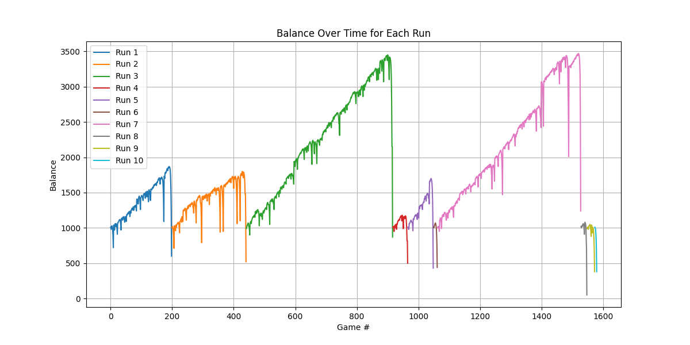
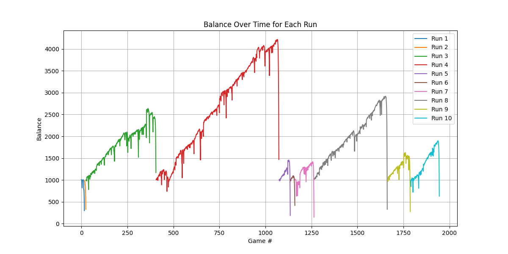
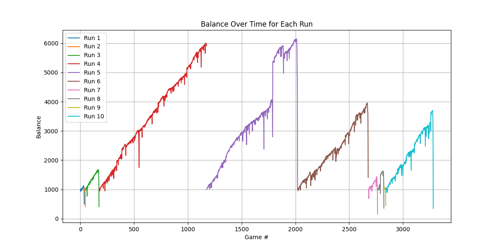
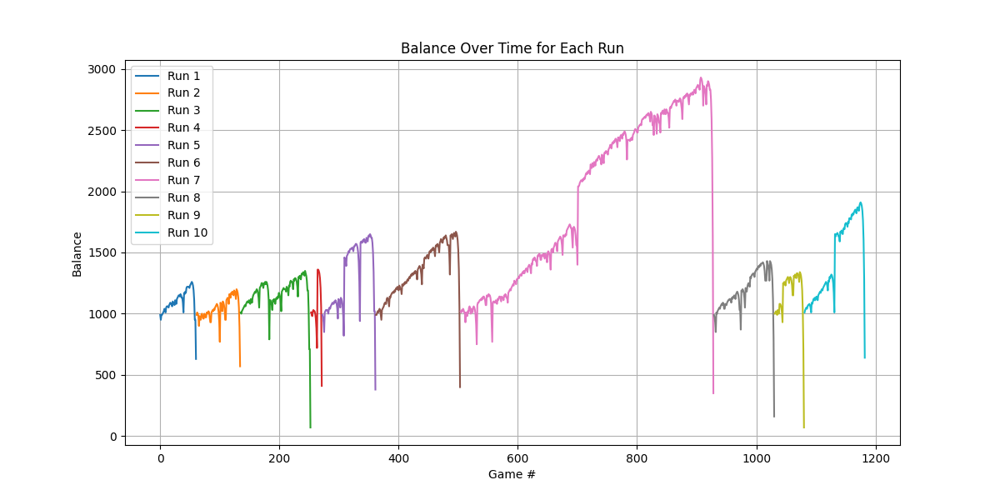

# Martingale Blackjack Simulator

This project is a simulation of the Martingale betting strategy applied to the game of Blackjack. The simulation runs multiple games across several runs to analyze the effectiveness of the strategy.

## Table of Contents

- [Features](#features)
- [Requirements](#requirements)
- [Installation](#installation)
- [Usage](#usage)
- [Simulation Details](#simulation-details)
- [CSV Output](#csv-output)
- [Analysis](#analysis)
- [License](#license)

## Features

- Simulates Blackjack games using basic strategy and the Martingale betting system.
- Tracks wins, losses, pushes, and balance over time.
- Outputs results to a CSV file.
- Provides a graphical analysis of balance trends over multiple runs.

## Requirements

- Python 3.x
- Required Python libraries:
  - `pandas`
  - `matplotlib`

## Installation

1. **Clone the repository:**

   ```bash
   git clone https://github.com/travisrecupero/martingale_blackjack_simulator.git
   cd martingale_blackjack_simulator
   ```

2. **Set up a virtual environment (optional but recommended):**

   ```bash
   python3 -m venv .venv
   source .venv/bin/activate  # On Windows, use .venv\Scripts\activate
   ```

3. **Install the required dependencies:**

   ```bash
   pip install -r requirements.txt
   ```

## Usage

Run the simulation by executing the `main.py` script:

```bash
python3 main.py
```

This will simulate 10 runs of 1,000 Blackjack games each, applying the Martingale betting strategy. The results are saved to `blackjack_results.csv`, and a graph showing balance trends over time is displayed at the end of the simulation.

## Simulation Details

- **Initial Balance:** $1,000
- **Initial Bet:** $10
- **Decks:** 6 (standard Blackjack setup)
- **Blackjack Value:** 21
- **Number of Games per Run:** 1,000
- **Number of Runs:** 10

### Martingale Betting System

The Martingale system is a progressive betting strategy where you double your bet after each loss. The theory is that an eventual win will recover all previous losses and yield a profit equal to the initial bet. However, this strategy can lead to rapid depletion of the bankroll if a losing streak occurs.

### Basic Strategy

During the game, the player's actions are based on the the outcome of each game. Here's a simplified overview of how these are handled:

- **Win**: If the player wins the game, their balance is increased by the bet amount. The bet is reset to the initial amount for the next game.

- **Loss**: If the player loses the game, their balance is reduced by the bet amount. The bet is doubled for the next game, following the Martingale strategy.

- **Push**: If the game results in a tie (neither win nor loss), the bet amount remains the same for the next game.

These actions and adjustments are designed to simulate the Martingale betting strategy and analyze its effectiveness over multiple games.


## CSV Output

The simulation results are written to `blackjack_results.csv`, with the following columns:

- **Run #:** The run number (1 through 10).
- **Game #:** The game number within the run (1 through 1,000).
- **Bet Amount:** The amount bet on that game.
- **Player Hand Total:** The total value of the player's hand.
- **Dealer Hand Total:** The total value of the dealer's hand.
- **Win/Loss:** The result of the game (Win, Loss, or Push).
- **Balance:** The player's balance after the game.

## Analysis

After running the simulation, the data is plotted to show how the balance changes over time for each run. This provides a visual representation of the potential risks and rewards of the Martingale betting strategy.

### Balance Over Time - Run 1



### Balance Over Time - Run 2



### Balance Over Time - Run 3



### Balance Over Time - Run 4



## License

This project is open-source and available under the MIT License. Feel free to use, modify, and distribute it as you like.
